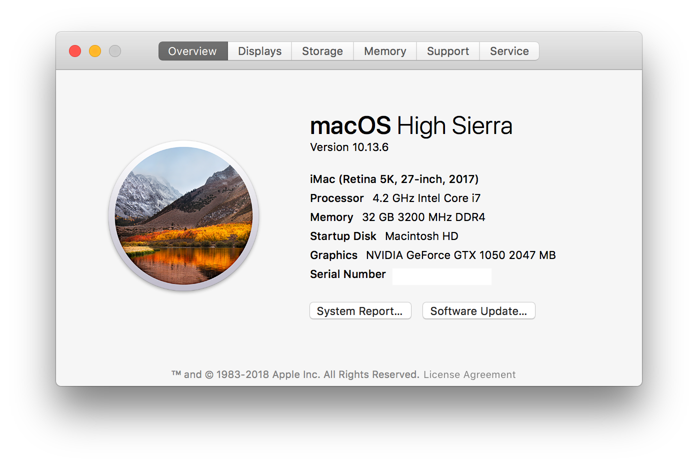

# Clover (Hackintosh) configuration for Asus ROG Strix Z270F running Mac OS 10.13.6 (17G65)

My clover configuration and a collection of kext's.

# Config
* Asus ROG Strix Z270F motherboard
* Intel Core i7 7700k Processor
* G.SKILL Ripjaws V Series 32GB (2 x 16GB) 288-Pin DDR4 SDRAM DDR4 3200 (PC4 25600)(F4-3200C16D-32GVK)
* Gigabyte Geforce GTX 1050 - 2GB
* ADATA Ultimate SU800 256GB 3D NAND SSD (Boot)
* Crucial BX200 480GB (CT480BX200SSD1)(Fusion Drive 1/2)
* Toshiba 4TB HDD (MD04ACA400)(Fusion Drive 2/2)
* 3Mbps Mini USB Bluetooth V4.0 Dongle (purchased from ebay for $3)(System information shows 'Cambridge Silicon Radio')
* ENEMAX Modu87+ 700W 80PLUS GOLD
* LG 27" 27UD68-W 4K LED Monitor

# Working
* Sleep/wake
* Sound (rear & front)
* Video hardware acceleration (4k@60hz) HDMI ([using Nvidia Web Drivers](https://github.com/vulgo/webdriver.sh))
* USB 3.0 (inc. USB 3.1 and USB-C ports)
* Continuity (BT4LEContiunityFixup.kext)
* Intel I219V2 PCI Express Gigabit Ethernet (IntelMausiEthernet.kext)

# iMessage / Facetime

I'm using a MLB/ROM from a real Macbook to get iMessage and Facetime working.  Those values are not included in this repo.
